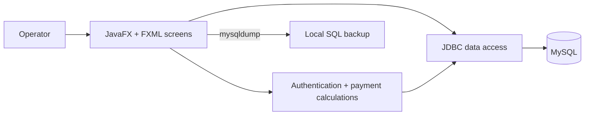

# Kindergarden Paydesk

Kindergarden Paydesk is a JavaFX desktop application for recording kindergarten fees, payments, receipts, and related activity for Garderie Almohtadine. It was developed as a university integration project and remains a learning-scale desktop application. The codebase is useful for exploring JavaFX/FXML screens, JDBC data access, payment calculations, and local MySQL backup workflows.

## What it does

- Manages children, school years, monthly fee records, and extra charges.
- Records full and partial payments with receipt data.
- Shows payment totals, remaining balances, advances, and payment status.
- Provides `ADMIN` (Administrateur) and `PERSONNEL` roles; account management and activity-log screens are restricted to administrators in the application UI.
- Creates local SQL backups through the MySQL `mysqldump` utility.
- Records application activity separately from backup attempts.

This is a local desktop app, not a web service. Its role checks and in-memory session are application controls; they do not provide enterprise-grade security or server-side authorization.

## Architecture



The payment screen writes the payment entry and receipt in one JDBC transaction. See [payment transaction](src/main/java/almohtadinepaydesk/services/PaymentTransactionService.java), [payment calculations](src/main/java/almohtadinepaydesk/services/PaymentCalculationService.java), [authentication](src/main/java/almohtadinepaydesk/services/AuthService.java), [user lookup](src/main/java/almohtadinepaydesk/dao/UserDao.java), and [backup implementation](src/main/java/almohtadinepaydesk/backup/BackupService.java). More detail is in [Architecture and data flow](docs/architecture.md).

## Requirements

- JDK 25
- Maven 3.9 or later
- A local MySQL server
- MySQL command-line client tools, including `mysqldump`, for backups

The Maven build declares JavaFX 25.0.2 and MySQL Connector/J 9.5.0. A graphical desktop session is needed to open the JavaFX UI. Use synthetic records for evaluation and screenshots; this repository does not include a verified screenshot.

## Local configuration

Copy [`paydesk.properties.example`](paydesk.properties.example) to `paydesk.properties` in the directory from which Maven/application is started. Edit the local copy for your MySQL instance. The local file is ignored by Git; do not commit database credentials. Environment variables named `PAYDESK_DB_HOST`, `PAYDESK_DB_PORT`, `PAYDESK_DB_DATABASE`, `PAYDESK_DB_USER`, `PAYDESK_DB_PASSWORD`, and `PAYDESK_DB_MYSQLDUMP` override the corresponding `db.*` property. If neither source sets a value, development defaults are `localhost:3306`, database `almohtadine_paydesk_db`, user `root`, and an empty password. Prefer a dedicated local MySQL account with only the permissions needed for the app.

Example for PowerShell, run from the repository directory:

```powershell
Copy-Item paydesk.properties.example paydesk.properties
notepad paydesk.properties
```

The optional `db.mysqldump` setting is the absolute path to the executable when it is not available through PATH. Keep passwords out of shell command lines and screenshots.

## Database setup

Create the database and tables before first login. The schema and seed SQL are in `src/main/resources/database/`. After local configuration, run the explicit initializer from the project root:

```powershell
mvn compile exec:java "-Dexec.mainClass=almohtadinepaydesk.database.SchemaInitializer"
```

The initializer connects using the configured account, creates/updates the configured schema, and loads the seed data. It is an explicit setup step; normal desktop launch does not initialize the database automatically. The account therefore needs permission to create the database and tables for the first initialization. Run it only for a fresh disposable/local setup: every run executes `seed.sql`, whose duplicate-key clauses reactivate and restore the seeded admin role, reset the seeded school year and months to active/default values, and overwrite the `garderie_name`, `payment_deadline_day`, and `backup_folder` settings with seed defaults. The seeded admin password hash and salt are preserved on duplicate username, but its role and active flag are reset. Routine reruns can therefore overwrite settings and application state. Back up valuable data first and do not use this initializer as a general repair command.

The seed SQL creates the initial account `admin` with temporary password `admin123`. After the first successful login, change this password in the application. The code migrates legacy plaintext password storage to salted PBKDF2 on successful login; schema setup may also upgrade the seeded account. Do not expose the initial credentials on a deployed or shared system.

## Build and run

From the repository root, after configuring MySQL and running the one-time initializer above:

```powershell
mvn clean javafx:run
```

Maven downloads declared dependencies as needed. The JavaFX application opens the login screen. Follow the account and password guidance above on a fresh local database.

## Backup and recovery

Choose a writable destination folder in the application settings, then use the backup screen. Ensure `mysqldump` is installed and available to the app. Backup history records attempts and their reported status. A successful backup command does not prove that the dump can be restored; recovery must be checked separately in a disposable database. See the [isolated restore exercise](docs/restore-exercise.md) and [troubleshooting guide](docs/troubleshooting.md).

## Verification

Run `mvn clean test` for the isolated suite. [Verification and reproducible labs](docs/verification.md) records 16 passing tests on Ubuntu/JDK 25, including payment rollback, safe login failures, and backup failure/configuration handling. These checks use synthetic fixtures; JavaFX interaction, a real MySQL setup, and database recovery remain unverified.

## Repository map

- `src/main/java/almohtadinepaydesk/controllers` — JavaFX screen controllers
- `src/main/java/almohtadinepaydesk/dao` — JDBC queries and persistence
- `src/main/java/almohtadinepaydesk/services` — authentication and payment logic
- `src/main/java/almohtadinepaydesk/models` — application data models and enums
- `src/main/java/almohtadinepaydesk/database` — connection settings and schema initialization
- `src/main/java/almohtadinepaydesk/backup` — local SQL dump workflow
- `src/main/resources/fxml` and `css` — screen layouts and styling
- `src/main/resources/database` — schema and initial seed records

## Academic context and attribution

This project retains its academic identity and original French interface. Labels, messages, and domain terms remain in French where used by the application. Refer to the repository's existing attribution and asset notices; no license is inferred by this documentation.
