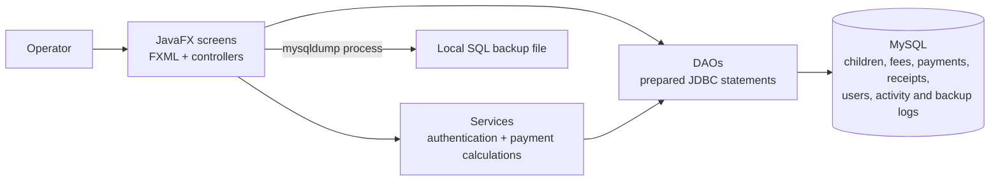

# Architecture and data flow

Kindergarden Paydesk is an academic JavaFX desktop application. FXML describes the screens, controllers coordinate user actions, services hold focused calculations and authentication behavior, DAOs issue JDBC queries, and MySQL stores the application records. This is a small single-client application architecture, not a deployed service or a claim of production-grade security.

## Payment and receipt flow

The payment detail screen validates the amount, date, and method, normalizes monetary values to three decimal places, and delegates creation of the payment entry and receipt to [PaymentTransactionService](../src/main/java/almohtadinepaydesk/services/PaymentTransactionService.java). Both records use one JDBC transaction; a failed insert rolls back the unit of work. Monthly totals and status are recalculated from recorded payments; see [PaymentDetailController](../src/main/java/almohtadinepaydesk/controllers/PaymentDetailController.java), [PaymentCalculationService](../src/main/java/almohtadinepaydesk/services/PaymentCalculationService.java), and [PaymentStatusService](../src/main/java/almohtadinepaydesk/services/PaymentStatusService.java).

The calculations distinguish the expected amount, amount paid, remaining balance, and any advance. A positive payment may exceed the expected amount; the excess is represented as an advance. Invalid or non-positive amounts are rejected by the payment form.

## Authentication and roles

`AuthService` checks credentials and maintains the in-memory desktop session through `Session`. Password handling and credential migration are implemented in [AuthService](../src/main/java/almohtadinepaydesk/services/AuthService.java) and [PasswordUtil](../src/main/java/almohtadinepaydesk/security/PasswordUtil.java); user lookups are in [UserDao](../src/main/java/almohtadinepaydesk/dao/UserDao.java).

The current roles are `ADMIN` (Administrateur) and `PERSONNEL`. The UI restricts access to user management and activity-log screens to administrators. Other workflow access is coordinated by the JavaFX application. This role handling is application-level control in a local desktop program; it does not replace database-side authorization or provide isolation between mutually untrusted local users.

Database settings come from `paydesk.properties` in the process working directory, with `PAYDESK_DB_*` environment variables taking precedence and local development defaults last. JDBC and backup use the same configured host, port, database, and credentials. Schema setup is a deliberate command-line step through `SchemaInitializer`, not an automatic action on every app launch.

## Backup and logs

The backup screen launches `mysqldump` and writes an SQL file to a folder chosen in the application. The operation has a bounded 120-second wait; credentials are supplied through a temporary option file rather than command-line arguments, and unsuccessful partial dumps are removed. Backup attempt status is recorded in the `backup_logs` table. Application activity events are stored separately as business/user activity in `activity_logs`; they are not a general diagnostic log or a substitute for stack traces and database/server logs. See [BackupService](../src/main/java/almohtadinepaydesk/backup/BackupService.java).

A successful dump process indicates that a file was produced successfully according to the command's exit result. It does not establish that the file can be restored. Recovery confidence requires a restore into a separate disposable database and checks of the resulting schema and representative rows; see [the restore exercise](restore-exercise.md).
